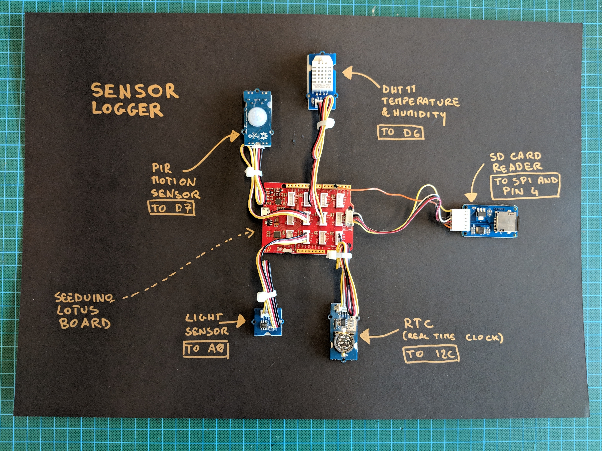

# how to connect your kit

Connect the kit as shown in the picture above:

component  |	connection
--|--
**PIR** motion sensor  | D7
**DHT11** temperature and humidity  | D6
**SD** Card Reader  | To the spi connector + CS to pin 4
**LDR** Light Sensor | A0
**RTC** real time clock | I2c
